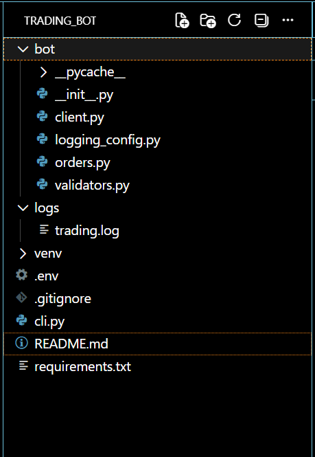
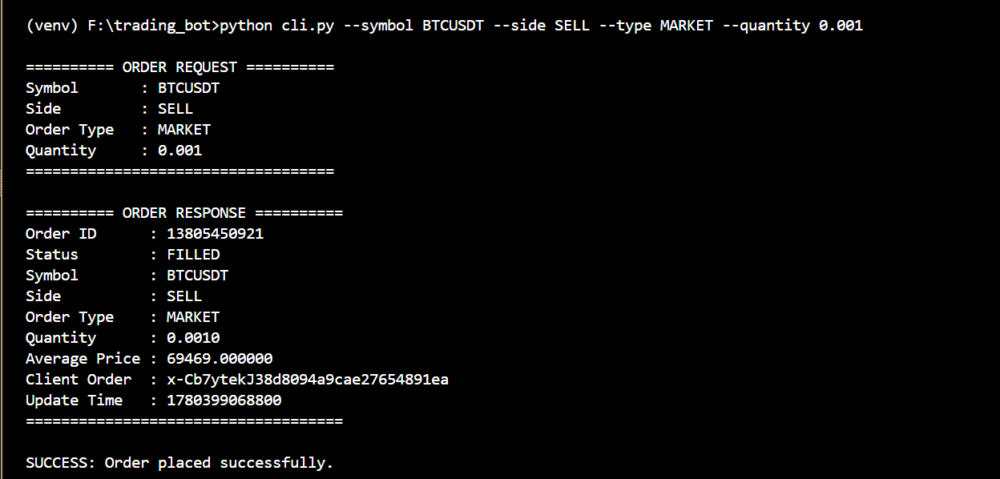
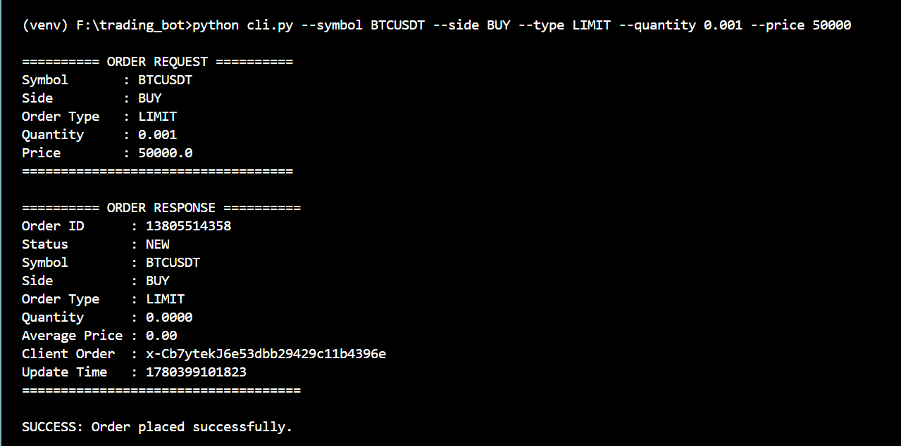
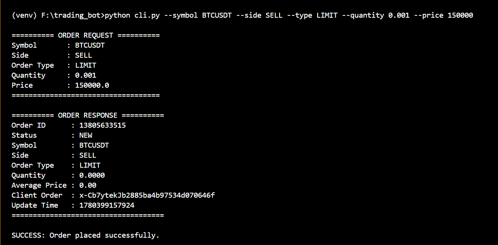
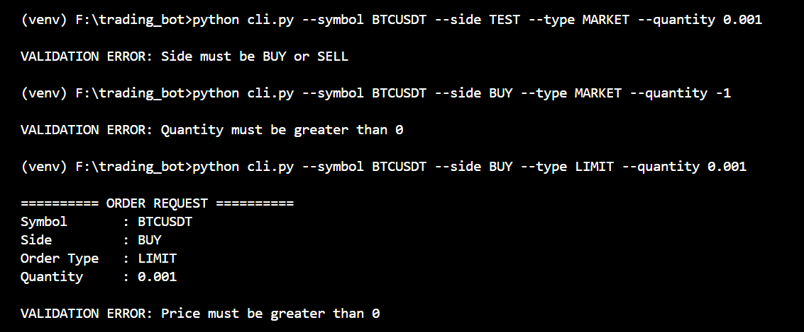
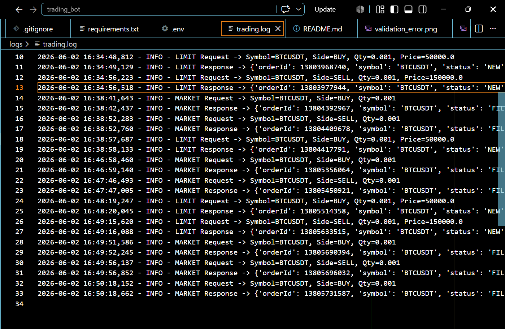

# Binance Futures Testnet Trading Bot

## Application Task

This project was developed as part of the Python Developer application task. The objective was to build a simplified trading bot capable of placing orders on Binance Futures Testnet (USDT-M) while demonstrating clean code structure, validation, logging, exception handling, and command-line interaction.

---

## Objective

Develop a Python-based trading bot that:

* Connects to Binance Futures Testnet
* Places MARKET and LIMIT orders
* Supports BUY and SELL operations
* Accepts user input through CLI
* Performs input validation
* Logs API requests, responses, and errors
* Handles exceptions gracefully
* Provides clear execution output

---

## Features

### Order Types Supported

* MARKET Orders
* LIMIT Orders

### Trading Actions

* BUY
* SELL

### Input Validation

* Symbol validation
* Side validation (BUY/SELL)
* Order type validation (MARKET/LIMIT)
* Quantity validation
* Price validation for LIMIT orders

### Logging

* Request logging
* Response logging
* Error logging

### Error Handling

* Invalid user inputs
* Binance API exceptions
* Network-related failures

---

## Project Structure

trading_bot/

├── bot/

│ ├── client.py

│ ├── orders.py

│ ├── validators.py

│ └── logging_config.py

│

├── logs/

│ └── trading.log

│

├── cli.py

├── requirements.txt

├── README.md

├── .gitignore

└── .env

---

## Technologies Used

* Python 3.x
* python-binance
* argparse
* python-dotenv
* logging

---

## Installation Steps

### 1. Clone Repository

```bash
git clone https://github.com/swaran-nani022/trading_bot.git

cd trading-bot
```

### 2. Create Virtual Environment

```bash
python -m venv venv
```

### 3. Activate Virtual Environment

Windows:

```bash
venv\Scripts\activate
```

Linux / Mac:

```bash
source venv/bin/activate
```

### 4. Install Dependencies

```bash
pip install -r requirements.txt
```

---

## Binance Testnet Setup

### Create Testnet Account

Visit:

https://testnet.binancefuture.com

### Generate API Credentials

Create:

* API Key
* Secret Key

### Create .env File

```env
API_KEY=YOUR_TESTNET_API_KEY
API_SECRET=YOUR_TESTNET_SECRET_KEY
```

---

## Running the Application

### MARKET BUY

```bash
python cli.py --symbol BTCUSDT --side BUY --type MARKET --quantity 0.001
```

### MARKET SELL

```bash
python cli.py --symbol BTCUSDT --side SELL --type MARKET --quantity 0.001
```

### LIMIT BUY

```bash
python cli.py --symbol BTCUSDT --side BUY --type LIMIT --quantity 0.001 --price 50000
```

### LIMIT SELL

```bash
python cli.py --symbol BTCUSDT --side SELL --type LIMIT --quantity 0.001 --price 150000
```

---

## Validation Examples

### Invalid Side

```bash
python cli.py --symbol BTCUSDT --side TEST --type MARKET --quantity 0.001
```

Output:

```text
VALIDATION ERROR: Side must be BUY or SELL
```

---

### Invalid Quantity

```bash
python cli.py --symbol BTCUSDT --side BUY --type MARKET --quantity -1
```

Output:

```text
VALIDATION ERROR: Quantity must be greater than 0
```

---

### LIMIT Order Without Price

```bash
python cli.py --symbol BTCUSDT --side BUY --type LIMIT --quantity 0.001
```

Output:

```text
VALIDATION ERROR: Price must be greater than 0
```

---

## Sample Output

```text
========== ORDER REQUEST ==========
Symbol       : BTCUSDT
Side         : BUY
Order Type   : MARKET
Quantity     : 0.001
===================================

========== ORDER RESPONSE ==========
Order ID      : 13803933588
Status        : NEW
Symbol        : BTCUSDT
Side          : BUY
Order Type    : MARKET
Quantity      : 0.001
Average Price : 0.00
====================================

SUCCESS: Order placed successfully.
```

---

## Logging

All API requests, responses, and errors are stored in:

```text
logs/trading.log
```

Example:

```text
MARKET Request -> Symbol=BTCUSDT, Side=BUY, Qty=0.001

MARKET Response -> {...}

LIMIT Request -> Symbol=BTCUSDT, Side=SELL, Qty=0.001, Price=150000

LIMIT Response -> {...}
```

---

## Screenshots

### Project Structure

```markdown

```

### MARKET BUY Order

```markdown

```

### MARKET SELL Order

```markdown

```

### LIMIT BUY Order

```markdown

```

### LIMIT SELL Order

```markdown

```

### Validation Error Example

```markdown

```

### Trading Log File

```markdown

```

---

## Assumptions

* Binance Futures Testnet account is active.
* Valid API credentials are available.
* Internet connectivity is available.
* User has sufficient testnet balance.
* Orders are executed only on Binance Futures Testnet.

---

## Future Enhancements

* Stop-Limit Orders
* OCO Orders
* Grid Trading Strategy
* TWAP Execution
* Interactive CLI Menus
* Streamlit Dashboard
* Trade History Viewer
* Portfolio Analytics

---

## Author

Akkapelli Swaran

Python Developer Application Task Submission